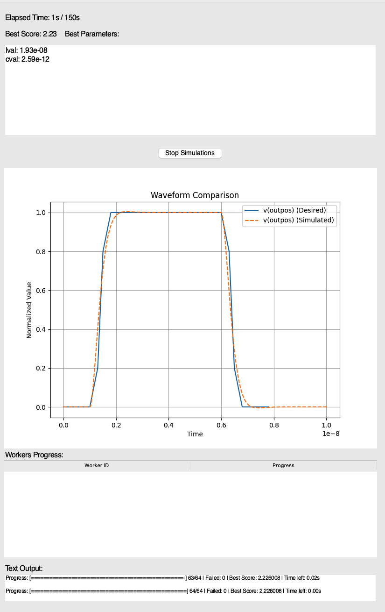
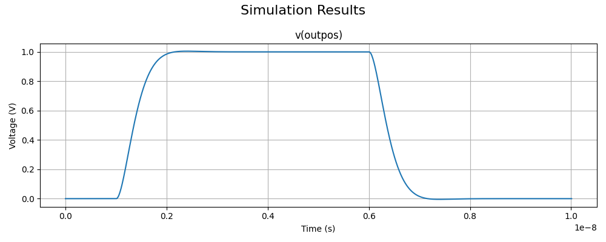

Welcome to Spicewrapper's documentation!
===================================

**Spicewrapper** is a python library containing a variety of convenience functions for NGSpice.  These include:

- Optimization: specify which netlist parameters you want to vary to achieve a given outcome from the simulation.

   - Randomized grid search: Iterate over the shuffled set of parameter combinations, and find the best one.

   - Basinhopping: Use python's basinhopping optimizer to combine a stochastic search with gradient optimization.

   - Outcomes: specify an objective function for the simulation based on any measurable quantity from it. For example, you can specify the functional form of current through an inductor over time, or instruct it to minimize DC source energy consumption.

   - Objective functions: can specify python functions, or a series of time-value pairs and interpolate around them.

   - Waveform construction: includes a simple GUI tool to draw waveforms quickly

- Sweeps: run large parameter sweeps for your circuit.  
- Simplified results: simulation outcomes are conveniently returned as Dataframes, organized logically and simply.  No more parsing raw files!
- Built-in multiprocessing: Run as many NGSpice instances in parallel as you want!  Or, at least, with as many physical cores as you have. Boosts simulation throughput considerably, especially for large sweeps and optimization runs.
- Flexible directory management: You can tell spicewrapper where your circuit file is, subcircuit files are, etc., and it will manage the connection.

Spicewrapper is not meant to be a complete python wrapper for NGSpice, like Pyspice.  It basically reads the netlist, makes a temporary copy with some small changes for sweeping parameters and saving data more conveniently, then runs NGSpice in some number of parallel instances.  It saves and organizes the output data into convenient dataframes.  As such, you should be familiar with netlists, or at least be able to generate them via LTSpice, KiCad, or similar software.  

This code is in a very early state and has some limitations as a result.  It's only written for transient simulations right now, so you can't analyze the result of steady-state simulations or frequency-domain simulations.  It's possible to add this in the future, though.

You may get used to working purely with netlists while using this code.  A suggestion I have is to learn to use subcircuits extensively.  Most of the time, issues with SPICE netlists are due to excessively long and complicated nets for every individual simulation you want to run.  Whenever possible, you should test small, modular subcircuits and confirm that they behave correctly and have the right connectivity, then save them into a library and reuse them in more complex circuits.  Most designs, even fairly complex ones involving many components, can be reduced to just a few lines of code in your netlist by reusing these blocks appropriately.

Other Guides
------------

For a tutorial on using JJs in Spicewrapper/NGSpice, see :doc:`JJs in NGSpice <jjs_in_ngspice>`.

Prologue: Python and NGSpice
--------

**Windows**

1. Install the official python distributable https://www.python.org/downloads/windows/ 

   1. Note that you need Python 3.10 or higher for this to work properly. Multiprocessing capabilities are frequently updated, and no guarantee of behavior is possible with an outdated version of Python.

2. Install NGSpice, latest version: https://ngspice.sourceforge.io/download.html 
3. Move the NGSpice folder wherever you want it, then copy the path to the folder where the .exe is stored (you can click on the windows explorer bar and ctrl+c to grab it once you've navigated to it)
4. Add the NGSpice path to your Windows PATH environment variables:

   1. Press windows and type "Environment variables" and go to the "edit environment variables for your account" suggestion
   2. Click on the "Path" user variable and click the "Edit" button
   3. Click "new" on the popup window, and paste the path that you copied to the ngspice executable earlier.  **Note: the path shouldn't include the .exe name itself!**
   4. Hit OK to close all the windows for this stuff.

5. Open command prompt (from any directory) and try typing ``ngspice`` and pressing enter.  You should see a 90's looking GUI pop up in a small window.  If you don't, something is wrong with your PATH variable for Windows.
6. If you haven't already, install a good IDE.  I recommend Cursor: https://www.cursor.com 
7. Proceed to the steps in "Getting Started", next.

Getting started
--------
1. Clone the git repo to your computer from http://www.github.com/pseudotexan/spicewrapper
2. Install dependencies, if needed:
   1. numpy
   2. pandas
   3. matplotlib
   4. scipy
   5. pyperclip
3. In the spicewrapper folder, go to ``example_scripts/pulse_filter_grid_optimization_script.py``
4. Near the top, modify the ``path_to_spicewrapper`` path to reflect the **actual git directory** on your computer.  Note that it will have a different structure depending on the OS you're using. This change will make it easier to copy this example file and use it in other project directories unrelated to spicewrapper.

Running a simple example
--------
In this example, we'll run one of the included scripts, ``example_scripts/pulse_filter_grid_optimization_script.py``, to showcase some of the useful features of Spicewrapper.  

This example uses a netlist file, ``example_circuits/pulse_filter.cir``, which implements a simple RLC lowpass filter.  The values of each element are parameterized in the netlist, i.e. ``.param rval = 50``.  Spicewrapper looks for parameter values in the ``.cir`` file (note: it does not look in subcircuits for parameters) and updates their values as needed for sweeps or optimization runs.  Note that it never directly modifies your circuit file; changes are always made to a temporary copy created in the temporary folder of the spicewrapper directory.

The goal of this script is to optimize the L and C values to smooth out a sharp input voltage pulse.  It will search a log-spaced grid of parameter value combinations and find the set of values with the most nearly ideal result.  We'll break down the script and explain how this happens.

Before proceeding with this example, note that you can also find a stripped-down, single-simulation example in ``example_scripts/squid_single_simulation.py`` that shows you how to "just run NGSpice on a circuit" without extra stuff.

**Paths and files**

.. code-block:: python

   #define the circuit file and subcircuit path
   circuit_filename = 'pulse_filter.cir'
   
   #here, the script directory is the directory of this file
   script_dir = os.path.dirname(os.path.abspath(__file__))
   
   #define the circuit file path, assumed to be in the same directory as this file in this case
   cir_file_path = os.path.join(script_dir, '..', 'example_circuits', circuit_filename)
   
   #define the subcircuit path - this is where all subcircuits are stored
   subcircuit_path = os.path.join(script_dir, '..', 'included_subcircuits')

These lines tell Spicewrapper where to find the various files that are needed to run the simulation: the main netlist file (circuit file or .cir), and the subcircuits directory, where .sub files will be referenced from.  Spicewrapper will modify the netlist so that any subcircuit includes will reference the actual directory.  The default settings work for the examples, but you should modify them when you decide on a more permanent working directory for a given project.  Thankfully, you can run these scripts from anywhere, and with the right directory settings on the script, they will still correctly import and use the spicewrapper modules on your system.

**Optional: Parameter Name Extraction**

You can run this line if you want to save a neatly formatted list of parameters to the clipboard.
``spice_utils.extract_and_format_parameters(cir_file_path)``.

This comes in handy for specifying a parameter sweep and saves you the time of manually hunting through the netlist to find the parameters.  The clipboard will grab something like this when it's run:

.. code-block:: python

    params = {
        'rval': [50.0, 500.0, 8, 'log'],
        'lval': [1e-07, 1e-06, 8, 'log'],
        'cval': [1e-10, 1e-09, 8, 'log']
    }

You can then trim uninteresting parameters, and modify the ranges to a sensible/meaningful value (they default to a range roughly located around the default value from the netlist).  Note that depending on the type of run (grid or basinhopping optimization), there is an optional argument that affects the formatting of the output.

**Parameters**

In this example, the parameters are specified like this:

.. code-block:: python

   #define the parameters that we want to sweep during the optimization
   params = {
       'lval': [1e-10, 1e-6, 8,'log'], #parameter name, min, max, number of points, type of sweep ('lin' or 'log')
       'cval': [5e-14, 5e-11, 8,'log'],
   }

The simulation will iterate over all combinations of both variables, in this case, an 8x8 grid, where the values are logarithmically spaced from the minimum to the maximum value for each parameter.  The values are initially shuffled into a random order to avoid "hugging" the edge values at the beginning.

**Objective Waveforms and User Functions**

How does it know what a good simulation result is?  Spicewrapper lets you define a user function like so:

.. code-block:: python

   def user_function(df):
    wf_result = data_processing.evaluate_objective_waveforms(waveforms, df)
    return wf_result

The ``waveforms`` passed to ``evaluate_objective_waveforms`` are specified here as:

.. code-block:: python

   #define the objective waveform that we want the variable to match
   #in this case, we want to smooth out the transitions of the pulse
   objective_waveform1 = {
       'variable': 'v(outpos)', #the name of the output variable to match, such as a voltage at a node or current through a device
       'time_value_pairs': 
           [(0, 0), #time, value pairs
            (1e-9, 0),
            (1.3e-9, 0.2),
            (1.5e-9, 0.8),
            (1.8e-9, 1), 
            (6.0e-9, 1), 
            (6.3e-9, 0.8),
            (6.5e-9, 0.2),
            (6.8e-9, 0),
            (7.8e-9, 0)],
       'deviation_size': 0.01, #actual deviation of the variable that is allowable from its objective value
       'interpolation_method': 'hermite', #how to interpolate between specified time value pairs
       'power': 1 #higher values penalize deviations more heavily
   }
   
   #this is the list of objective waveforms that we want to match during the optimization
   waveforms = [objective_waveform1]

In this simple example, we've written out a small set of discrete values that the variable ``v(outpos)`` (voltage at node "outpos") should closely follow over time.  We can specify other things about the penalty for deviations in the waveform as well.  You can include any number of waveforms to evaluate, or none at all.  Each time an NGSpice simulation completes, it evaluates the specified variable and compares the result to the "desired waveform" that you specified for it.  By default, Spicewrapper uses a convenient heuristic we call "deviational loss."  In short, the absolute error between the desired and actual values is taken as a fraction of a "deviation_size" and raised to a penalty power.  Note that the scale of deviation size is absolute, not fractional.  This has some advantages over a simple RMSE evaluation in that it may be less biased for functions with wide extremes in values.  Nevertheless, you may wish to use your own metric, and in that case you can define your ``user_function`` any way you want.  It just has to take in a ``spice_df`` dataframe (see formatting notes below) and return a scalar score value.

**Running the sweep**

Next, we call ``run_spicemanager`` to begin the optimization process.

.. code-block:: python

   best_result,all_results = simulation_runner.run_spicemanager(
    cir_file_path,
    subcircuit_path,
    params,
    user_function,
    process_timeout = 60, #timeout for each individual simulation process
    global_timeout = 150, #timeout for the entire simulation
    interpolation_timestep = 10e-12, #timestep for interpolation of data and waveforms
    mode = 'grid', #mode of simulation, can be 'grid' or 'basinhopping'
    mode_args = None, #optional: arguments for the mode, such as basinhopping arguments
    n_processes = 4, #number of processes to run in parallel
    temp_folder = 'temp_sim_files/', #folder to store temporary files such as modified circuits and output files
    waveforms = waveforms, #list of objective waveforms to match during the optimization
    randomize_params = True, #randomize the order of parameter combinations to speed up the optimization process
    ) 

It will bring up a GUI displaying the ongoing progress, including the best score (lowest/best optimizer value) and the objective waveforms for that particular parameter combination.  When finished, it will return two values representing a single dataframe with the best result, and a larger dataframe where each row is a simulation result representing a different parameter combination.

**Output data**

Spicewrapper has two significant data structures that you will receive.

1. The result dataframe (result_df)

This dataframe stores the results of individual NGSpice runs.  Each row represents the outcome of one run, and the columns contain all the important data.  The columns look like:

[index, circ_file_orig_contents, total_energy, spice_df, param1val, param2val, param3val, etc]

``index`` is the row index of the particular result. Nothing special.

``circ_file_orig_contents`` is the raw text of the circuit file used in that run.

``total_energy`` is the net energy consumed by all the DC voltage sources over the simulation window.  This calculation might fail for various reasons, most commonly when you don't have any DC voltage sources for it to calculate from.  In the future, this may be extended to other types of sources.

``spice_df`` is a dataframe itself which contains the values of all simulation variables over time.  We'll explain this later.

``paramXval`` is the value of the associated simulation parameter for this particular combination of parameter values.  If your parameter name in the netlist .cir file is actually ``rval``, then this column would be named ``rval``.  The remaining columns to the right are similar, just for the other parameter values from the simulation.

Some handy examples of accessing data from the results are provided at the end of ``squid_single_simulation.py`` in ``/example_scripts``.  There are many ways to access and use the data, but these are mentioned for convenience.

.. code-block:: python

   #access some data from the result dataframe
   #first get the spice_dataframe ('spice_df') which contains the simulation variable data
   spice_df = result['spice_df'].iloc[0]
   #get the 'i(l1)' variable data as a dataframe column
   i_l1 = spice_df['i(l1)']
   
   #get the value at time = 1e-9 seconds using the helper function in spice_utils
   i_l1_at_1ns = spice_utils.get_value_at_time(spice_df, 'i(l1)', 1e-9)
   print('value at 1ns: ', i_l1_at_1ns)
   
   #get the values of 'i(l1)' in the time range from 1e-9 seconds to 2e-9 seconds
   i_l1_in_range = spice_utils.get_values_in_time_range(spice_df, 'i(l1)', [1e-9, 2e-9])
   print('values in range: ', i_l1_in_range)
   

2. the spice_dataframe (spice_df)

The columns are [time, variable_name1, variable_name2, etc].  The rows are the timesteps produced by the simulation.  So you get the value of every variable at every timestep.  Note that Spicewrapper inherently interpolates timesteps along a fixed grid (that you specify in the call to ``run_spicemanager`` with the argument ``interpolation_timestep``).  

**Plotting and saving**

From here on out, you've got your data in dataframes, and you can obviously do whatever you want with it.  But we've thrown in a few convenience functions to speed some things up for beginners.  data_processing.simple_plot() and data_processing.plot_sweep_result() are discussed in ``squid_param_sweep.py`` and other examples.  

**Other Examples**

You can find more examples of interest in ``example_scripts/``. Each one is heavily documented in the ``.cir`` and ``.py`` script files. Here are some details to show you what's available first:

``pulse_filter_basinhopping_optimization_script``: This is similar to the example above, but instead of a brute-force grid parameter search, it uses a basinhopping optimization strategy.  This allows it to perform local gradient searches while still retaining the ability to escape from local minima when it has "stalled out." The example shows some differences in parameter specifications and various configuration settings that are necessary when operating in this mode.  It's worth noting that the basinhopping mode requires a great deal of fine-tuning of its parameters to work effectively, and for this reason, I don't recommend starting on it right away.  The grid strategy, with shuffled parameters, and carefully chosen parameter ranges and spacings, tends to produce good results with a fairly predictable runtime, and requires very little fine-tuning in comparison.

``squid_param_sweep.py``: The purpose of the example is mostly to show you how to use Spicewrapper for conventional parameter sweeps - like understanding the values of variables over time, as a function of different parameter settings in combinations. The resulting script requires fewer configuration settings.  It also shows you how to conveniently plot the results of these sweeps.

``squid_single_simulation.py``: This example uses a different circuit file, which represents a SQUID pulse readout from an SNSPD inductively coupled to it. The point of this script is to show you how to "just run a simple analysis" with no sweeps, bells, whistles, or kitchen sinks.

**Included Subcircuits**

These are included without any guarantee of scientific accuracy, performance, or reliability.  That said, they work reasonably well for a variety of obscure projects that we happen to be interested in.  You shouldn't use them for published data without rigorously verifying their correct behavior first.  They may also have parameters that only work sensibly within narrow ranges or use-cases, like the SOI-CMOS transistor model in the corresponding subcircuit file. Think of these as a way to hit the ground running, since they will allow you to model the behavior of relatively complex devices with reasonable accuracy.

Some included devices: 

-An SOI CMOS device, which acts like an FD-SOI transistor with a ~1V threshold voltage.  This is not particularly optimized right now.

-An RCSJ Josephson Junction (JJ) model.  It uses a virtual capacitor internal to the subcircuit to model the phase difference across the junction at any time; this is a fairly standard approach for SPICE JJ modeling.  It has been tested against WRSpice results on a couple of different simulations, including those with SQUIDs, while producing very good agreement.

-An SNSPD model, based on Karl Berggren's group's SNSPD SPICE model: https://github.com/qnngroup/snspd-spice.  This version has some misc tweaks to make it work better with NGSpice and devices of interest to us.

-An inverter using the SOI-CMOS model to showcase nested subcircuits.
